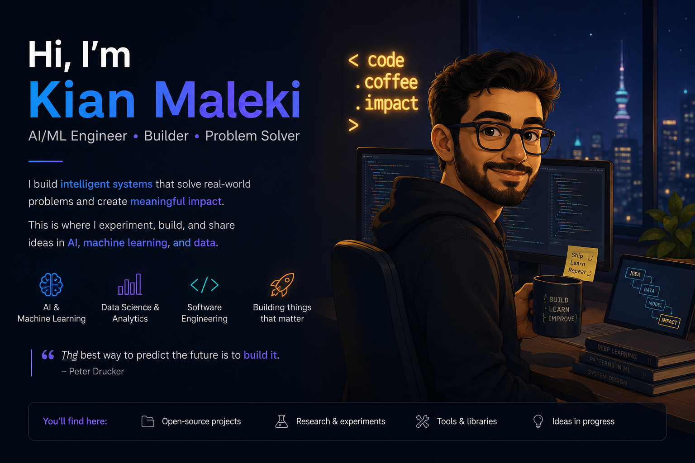

# Hi, I’m Kian Maleki, PhD 👋

I’m a **PhD physicist turned AI/ML builder** who enjoys turning mathematical ideas into useful, testable, and well-documented software.

My work sits at the intersection of **machine learning, scientific computing, document intelligence, retrieval-augmented generation, and model evaluation**. I like building systems that are not only accurate, but also interpretable, reproducible, and useful in real-world workflows.

---

## What I build

*I build intelligent systems with math in the engine room and usability on the dashboard.* 

- **AI and machine learning systems** for classification, prediction, and evaluation  
- **RAG and document intelligence tools** for extracting, searching, and reasoning over complex documents  
- **Model-evaluation frameworks** that go beyond single-number metrics  
- **Scientific computing projects** inspired by physics, optimization, and numerical modeling  
- **Portfolio-ready software** with clean structure, documentation, and practical demos  

---

## Selected projects

### PharmaDoc-AI  
A document-intelligence and RAG system for pharmaceutical-style documents, combining extraction, retrieval, OCR-aware workflows, and chatbot-style interaction.

### Ambiguity Framework  
A classifier-evaluation framework that studies ambiguity across decision thresholds instead of relying on one fixed threshold.

### Sequence Acceleration Benchmark  
A research-style benchmark exploring convergence acceleration and finite-horizon learning-curve prediction for gradient boosting models.

---

## Current focus

I am currently focused on:

- Retrieval-augmented generation  
- Document AI and OCR robustness  
- Applied machine learning systems  
- AI agents and tool-using workflows  
- Model reliability, evaluation, and uncertainty  
- Turning research ideas into clean, reusable software  

---

## Background

Before moving deeply into AI and machine learning, I worked in theoretical and computational physics, including quantum materials, molecular transport, open quantum systems, and numerical modeling.

That background shapes how I approach AI: I care about mechanisms, assumptions, failure modes, and whether a model actually behaves the way we think it does.

---

## Connect

- Website: https://drkianmaleki.com  
- LinkedIn: https://www.linkedin.com/in/kian-maleki-phd  
- ORCID: https://orcid.org/0000-0002-0317-8766  

---

